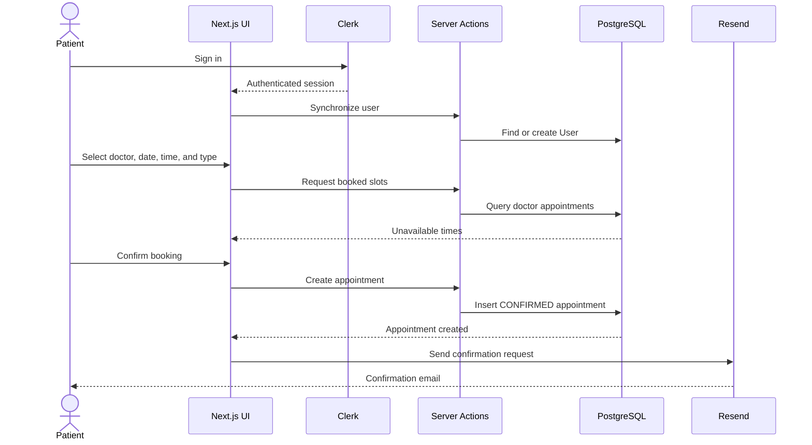
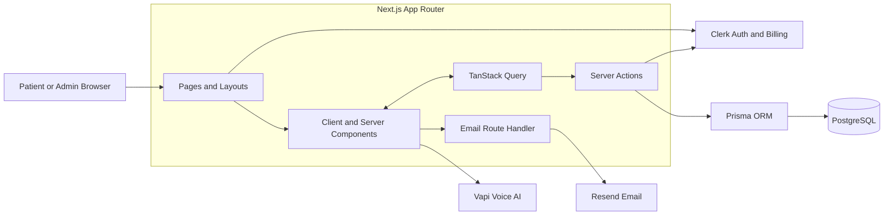
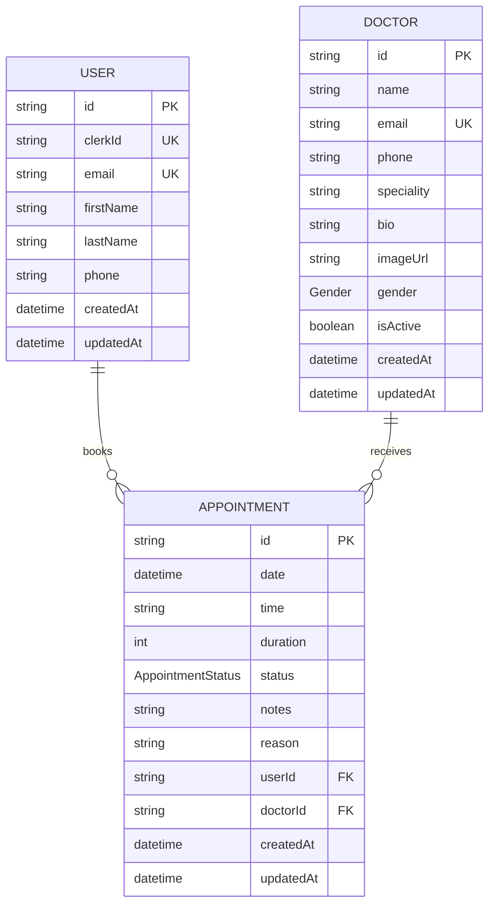

<div align="center">
  

  # Appointify

  **An AI-assisted dental appointment and patient-engagement platform built with Next.js.**

  Appointify combines online appointment scheduling, subscription-gated voice assistance, patient dashboards, administrative doctor management, and transactional email confirmations in one modern web application.

  
  
  
  
  
  
  
  

  [Overview](#overview) · [Features](#features) · [Architecture](#architecture) · [Getting Started](#getting-started) · [Configuration](#configuration) · [Deployment](#deployment)
</div>

---

## Overview

Appointify is a full-stack dental appointment platform designed around four connected experiences:

1. **Patients** can authenticate, browse active doctors, choose an appointment type, select an available date and time, and review upcoming appointments.
2. **Subscribers** can access a real-time AI voice assistant that provides general dental information and displays a live conversation transcript.
3. **Administrators** can add and edit doctors, activate or deactivate availability, review appointments, and update appointment status.
4. **The platform** coordinates authentication, persistence, caching, voice calls, and appointment-confirmation emails through a modern Next.js architecture.

The application is currently focused on dental care, but its structure can be adapted to other appointment-based services such as clinics, wellness centers, consulting practices, salons, and professional-service businesses.

> [!IMPORTANT]
> The AI assistant is intended for general educational guidance only. It must not be presented as a substitute for diagnosis, treatment, emergency care, or advice from a licensed healthcare professional.

---

## Features

### Patient experience

- Clerk-powered sign-up, sign-in, session management, and user profiles
- Automatic synchronization of authenticated Clerk users into PostgreSQL
- Personalized dashboard with appointment-oriented navigation
- Active-doctor directory with specialty, profile, gender, and avatar information
- Guided, multi-step appointment-booking experience
- Appointment types with configurable duration and displayed pricing
- Booked-slot detection for each doctor and date
- Upcoming-appointment history for the signed-in user
- Confirmation feedback after a successful booking
- Transactional appointment-confirmation email delivery
- Responsive, dark-first interface

### AI voice assistant

- Browser-based voice calls powered by Vapi
- Subscription entitlement checks before voice access
- Support for the Clerk Billing feature slugs `ai_basic` and `ai_pro`
- Live call-state indicators such as connecting, listening, and speaking
- Real-time final transcript messages for both the user and assistant
- Start-call and end-call controls
- Reference prompt content for a dental assistant persona named **Riley**
- Safety-oriented guidance for emergencies and clinical limitations

### Administration

- Server-rendered administrator access check
- Administrator identity controlled through `ADMIN_EMAIL`
- Doctor creation and editing
- Active/inactive doctor management
- Automatically generated doctor avatars
- Appointment overview and recent-activity table
- Appointment status transitions between `CONFIRMED` and `COMPLETED`
- Summary metrics for doctors and appointments

### Platform capabilities

- Next.js App Router with server and client components
- Server Actions for application data operations
- Prisma ORM with PostgreSQL
- TanStack Query for client-side fetching, caching, mutations, and invalidation
- Zod, React Hook Form, Radix UI, and reusable interface components
- Resend and React Email for confirmation messages
- Tailwind CSS for styling
- Sonner for toast notifications
- Turbopack-based development and production builds

---

## Product flow

### Appointment booking

1. A visitor signs in with Clerk.
2. Appointify synchronizes the Clerk profile with the local `User` record.
3. The patient opens the appointment page.
4. The application loads active doctors from PostgreSQL.
5. The patient selects a doctor.
6. The patient chooses a date, time, and appointment type.
7. Existing confirmed or completed appointments are used to disable unavailable slots.
8. A new appointment is created with `CONFIRMED` status.
9. The client requests an appointment-confirmation email.
10. The appointment list and related dashboard data are refreshed.



### Voice-assistant access

1. The user opens `/voice`.
2. The server verifies the active Clerk session.
3. Clerk Billing entitlements are checked for `ai_basic` or `ai_pro`.
4. Eligible users receive the Vapi-powered call interface.
5. The browser starts the configured Vapi assistant.
6. Call events and final transcript messages update the interface in real time.

### Administration

1. The administrator signs in through Clerk.
2. `/admin` compares the signed-in account email with `ADMIN_EMAIL`.
3. Authorized administrators can manage doctors and appointment status.
4. Deactivated doctors no longer appear in the patient booking directory.

---

## Current booking configuration

The booking interface currently defines the following appointment types:

| Appointment type | Duration | Displayed price |
|---|---:|---:|
| Regular Checkup | 60 minutes | $120 |
| Teeth Cleaning | 45 minutes | $90 |
| Consultation | 30 minutes | $75 |
| Emergency Visit | 30 minutes | $150 |

Available dates are generated for the next five days, beginning tomorrow. Time slots are currently offered in 30-minute increments during these windows:

- **Morning:** 9:00 AM–11:30 AM
- **Afternoon:** 2:00 PM–4:30 PM

These values are application constants and can be adapted to practice-specific hours, holidays, provider schedules, regional pricing, and appointment rules.

---

## Architecture



### Architectural responsibilities

| Layer | Responsibility |
|---|---|
| `src/app` | Routes, layouts, server-rendered access checks, and the email API handler |
| `src/components` | Landing, dashboard, appointment, voice, admin, email, and shared UI components |
| `src/hooks` | TanStack Query hooks for doctors, appointments, booking mutations, and dashboard data |
| `src/lib/actions` | Server-side user, doctor, and appointment operations |
| `src/lib/prisma.ts` | Development-safe Prisma client singleton |
| `src/lib/vapi.ts` | Browser Vapi client initialization |
| `src/lib/vapi-prompt.ts` | Reference voice-assistant prompt and safety guidance |
| `prisma/schema.prisma` | PostgreSQL models, relations, enums, and defaults |

---

## Data model

Appointify uses three primary entities.



### Enums

```prisma
enum Gender {
  MALE
  FEMALE
}

enum AppointmentStatus {
  CONFIRMED
  COMPLETED
}
```

Deleting a user or doctor cascades to that entity's related appointments. Doctor email, user email, and Clerk user ID are unique.

---

## Technology stack

| Category | Technology | Purpose |
|---|---|---|
| Framework | Next.js 15 | App Router, rendering, routing, Server Actions, and API routes |
| UI runtime | React 19 | Component-based user interface |
| Language | TypeScript | Static typing and maintainability |
| Styling | Tailwind CSS 4 | Utility-first responsive styling |
| UI primitives | Radix UI | Accessible dialogs, menus, labels, tabs, and other primitives |
| Forms | React Hook Form + Zod | Form state and schema validation |
| Authentication | Clerk | User authentication, profiles, sessions, and billing entitlements |
| Database | PostgreSQL | Relational application data |
| ORM | Prisma 6 | Schema management and type-safe database operations |
| Client data | TanStack Query | Fetching, caching, mutations, and invalidation |
| Voice AI | Vapi Web SDK | Real-time browser voice interaction |
| Email | Resend + React Email | Transactional appointment confirmations |
| Icons | Lucide React | Interface iconography |
| Notifications | Sonner | Toast messages |
| Dates | date-fns | Date generation and formatting |
| Charts | Recharts | Dashboard-ready data visualization support |

---

## Project structure

```text
appointify/
├── prisma/
│   └── schema.prisma                 # Database schema
├── public/                           # Logos and product illustrations
├── src/
│   ├── app/
│   │   ├── admin/                    # Protected administration dashboard
│   │   ├── api/
│   │   │   └── send-appointment-email/
│   │   │       └── route.ts          # Resend confirmation endpoint
│   │   ├── appointments/             # Patient appointment booking
│   │   ├── dashboard/                # Authenticated patient dashboard
│   │   ├── pro/                      # Clerk pricing table
│   │   ├── voice/                    # Subscription-gated AI assistant
│   │   ├── globals.css
│   │   ├── layout.tsx
│   │   └── page.tsx                  # Marketing landing page
│   ├── components/
│   │   ├── admin/                    # Doctor and appointment administration
│   │   ├── appointments/             # Booking and appointment UI
│   │   ├── dashboard/                # Dashboard sections and cards
│   │   ├── emails/                   # React Email templates
│   │   ├── landing/                  # Marketing-page sections
│   │   ├── providers/                # Application providers
│   │   ├── ui/                       # Reusable UI primitives
│   │   └── voice/                    # Vapi call interface
│   ├── hooks/
│   │   ├── use-appointment.ts        # Appointment queries and mutations
│   │   └── use-doctors.ts            # Doctor queries and mutations
│   ├── lib/
│   │   ├── actions/
│   │   │   ├── appointments.ts       # Appointment Server Actions
│   │   │   ├── doctors.ts            # Doctor Server Actions
│   │   │   └── user.ts               # Clerk-to-database synchronization
│   │   ├── prisma.ts                 # Prisma singleton
│   │   ├── resend.ts                 # Resend client
│   │   ├── utils.ts                  # Booking constants and helpers
│   │   ├── vapi-prompt.ts            # Reference assistant prompt
│   │   └── vapi.ts                   # Vapi client
│   └── middleware.ts                 # Clerk middleware
├── .env.example
├── package.json
└── README.md
```

---

## Getting started

### Prerequisites

Before running Appointify locally, prepare:

- Node.js 20 LTS or a compatible newer release
- npm
- A PostgreSQL database
- A Clerk application
- A Vapi account and assistant for the voice feature
- A Resend account for confirmation emails

### 1. Clone the repository

```bash
git clone https://github.com/kajugadaniels/appointify.git
cd appointify
```

### 2. Install dependencies

```bash
npm install
```

### 3. Configure environment variables

Copy the example file:

```bash
cp .env.example .env.local
```

Then add the complete configuration described in [Environment variables](#environment-variables).

### 4. Generate the Prisma client

```bash
npx prisma generate
```

### 5. Apply the database schema

For a migration-based local workflow:

```bash
npx prisma migrate dev --name init
```

For rapid local prototyping without creating a migration:

```bash
npx prisma db push
```

### 6. Start the development server

```bash
npm run dev
```

Open `http://localhost:3000` in your browser.

### 7. Create the first administrator

1. Sign in to the application with Clerk.
2. Set `ADMIN_EMAIL` to the exact primary email address used by that Clerk account.
3. Restart the development server after changing environment variables.
4. Open `http://localhost:3000/admin`.
5. Add at least one active doctor so patients can make bookings.

---

## Environment variables

The repository's example environment file includes the core Clerk, database, and Vapi assistant values. The current source also references additional variables for administrator access, the Vapi public key, and Resend.

Use the following complete local configuration:

```dotenv
# Clerk authentication
NEXT_PUBLIC_CLERK_PUBLISHABLE_KEY=
CLERK_SECRET_KEY=

# PostgreSQL
DATABASE_URL=

# Administrator access
ADMIN_EMAIL=

# Vapi voice assistant
NEXT_PUBLIC_VAPI_API_KEY=
NEXT_PUBLIC_VAPI_ASSISTANT_ID=

# Resend transactional email
RESEND_API_KEY=
```

| Variable | Required for | Visibility | Description |
|---|---|---|---|
| `NEXT_PUBLIC_CLERK_PUBLISHABLE_KEY` | Authentication | Browser-safe | Clerk frontend publishable key |
| `CLERK_SECRET_KEY` | Authentication | Server only | Clerk backend secret key |
| `DATABASE_URL` | Persistence | Server only | PostgreSQL connection string used by Prisma |
| `ADMIN_EMAIL` | Administration | Server only | Exact Clerk account email allowed to open `/admin` |
| `NEXT_PUBLIC_VAPI_API_KEY` | Voice assistant | Browser-visible | Vapi web/public API key used to initialize the SDK |
| `NEXT_PUBLIC_VAPI_ASSISTANT_ID` | Voice assistant | Browser-visible | Identifier of the configured Vapi assistant |
| `RESEND_API_KEY` | Email | Server only | API key used by the Resend client |

> [!CAUTION]
> Never expose server-only secrets in variables prefixed with `NEXT_PUBLIC_`. Only values explicitly intended for browser use should carry that prefix.

---

## Service configuration

### Clerk

1. Create a Clerk application.
2. Add the publishable and secret keys to `.env.local`.
3. Enable the sign-in methods appropriate for your deployment.
4. Configure production domains and redirect URLs.
5. To enable the voice subscription gate, configure Clerk Billing features whose slugs match:
   - `ai_basic`
   - `ai_pro`
6. Change the checks in `src/app/voice/page.tsx` if your feature slugs differ.

The root application synchronizes authenticated Clerk users into the local PostgreSQL `User` table. For a production system, consider supplementing this flow with Clerk webhooks so profile creation and updates do not depend on a page visit.

### PostgreSQL and Prisma

Set `DATABASE_URL` to a valid PostgreSQL connection string, then use:

```bash
npx prisma generate
npx prisma migrate dev
```

Open Prisma Studio when you need a local database browser:

```bash
npx prisma studio
```

For production deployments, apply committed migrations with:

```bash
npx prisma migrate deploy
```

### Vapi

1. Create a Vapi account.
2. Create or configure an assistant in the Vapi dashboard.
3. Add the browser-safe Vapi API key to `NEXT_PUBLIC_VAPI_API_KEY`.
4. Add the assistant ID to `NEXT_PUBLIC_VAPI_ASSISTANT_ID`.
5. Configure microphone permissions for the deployment origin.
6. Review `src/lib/vapi-prompt.ts` for the intended Riley persona and safety boundaries.

The prompt file is a reference implementation. Ensure the live assistant configured in Vapi uses the approved system prompt, pricing, escalation rules, and medical disclaimers.

### Resend

1. Create a Resend API key.
2. Set `RESEND_API_KEY`.
3. Verify a sending domain for production.
4. Replace the development sender in the email route with an address on the verified domain.
5. Test delivery and failure handling before launch.

The current route sends an `AppointmentConfirmationEmail` React Email template with doctor, date, time, appointment type, duration, and displayed price details.

---

## Application routes

| Route | Access | Purpose |
|---|---|---|
| `/` | Public | Marketing landing page and authenticated-user synchronization |
| `/dashboard` | Authenticated experience | Patient home and appointment overview |
| `/appointments` | Authenticated experience | Doctor selection, slot selection, and booking |
| `/voice` | Authenticated + entitled | Vapi-powered AI dental assistant |
| `/pro` | Authenticated | Clerk pricing and subscription interface |
| `/admin` | Matching `ADMIN_EMAIL` | Doctor and appointment administration |
| `/api/send-appointment-email` | API route | Sends appointment-confirmation emails |

Authentication middleware is applied across application routes while excluding static Next.js assets. Individual server-rendered pages and data operations should still enforce their own authorization rules.

---

## API reference

### Send appointment confirmation

```http
POST /api/send-appointment-email
Content-Type: application/json
```

#### Request body

```json
{
  "userEmail": "patient@example.com",
  "doctorName": "Dr. Ada Kim",
  "appointmentDate": "2026-08-04",
  "appointmentTime": "10:30",
  "appointmentType": "Regular Checkup",
  "duration": 60,
  "price": 120
}
```

#### Success response

```json
{
  "success": true,
  "data": {}
}
```

#### Validation or delivery failure

```json
{
  "success": false,
  "error": "Error message"
}
```

For production, authenticate or otherwise protect this endpoint, validate the payload with a strict schema, and add rate limiting to prevent email abuse.

---

## Server actions and client data

### Appointment operations

The appointment action layer supports:

- Retrieving all appointments
- Retrieving appointments for the signed-in user
- Counting total and completed appointments
- Querying booked slots by doctor and date
- Creating a confirmed appointment
- Updating appointment status

The React Query appointment hooks coordinate these operations, expose loading and error states, and invalidate affected caches after mutations.

### Doctor operations

The doctor action layer supports:

- Retrieving all doctors for administration
- Retrieving active doctors for patients
- Creating doctors
- Updating doctor information
- Activating or deactivating doctors
- Returning appointment counts with doctor records

New doctors receive an automatically generated avatar URL based on name and gender.

### User synchronization

The user action layer:

1. Reads the authenticated Clerk user.
2. Searches PostgreSQL by Clerk user ID.
3. Creates the local user when no record exists.
4. Stores email, first name, last name, and phone when available.

---

## Available scripts

| Command | Description |
|---|---|
| `npm run dev` | Start the Turbopack development server |
| `npm run build` | Create a production build with Turbopack |
| `npm run start` | Start the compiled production server |
| `npm run lint` | Run ESLint |
| `npx prisma generate` | Generate the Prisma client |
| `npx prisma migrate dev` | Create/apply local migrations |
| `npx prisma migrate deploy` | Apply committed production migrations |
| `npx prisma studio` | Open the Prisma database browser |

---

## UI and design system

Appointify uses a component-oriented UI system built from Tailwind CSS and Radix UI primitives. The codebase contains reusable components for:

- Buttons, cards, dialogs, dropdowns, inputs, labels, tabs, and tooltips
- Responsive navigation
- Landing-page sections
- Doctor cards and selection states
- Date, time, and appointment-type selection
- Confirmation modals
- Dashboard cards and activity summaries
- Administrative forms and tables
- Voice-call controls and transcript messages
- Transactional email markup

The root layout enables dark mode by default. Theme tokens and global visual behavior can be adjusted in `src/app/globals.css`.

---

## Production hardening checklist

The current repository is a strong application foundation. Before using it for real patient operations, address the following areas.

### Authorization

- Enforce administrator authorization inside every doctor-management and global appointment Server Action.
- Do not rely exclusively on the `/admin` page redirect to protect privileged mutations.
- Verify that users can only retrieve and mutate records they are allowed to access.
- Protect the email API endpoint from arbitrary public use.

### Booking integrity

- Add a database-level uniqueness strategy for doctor, date, and time.
- Use a transaction or conflict-safe insert to prevent simultaneous double-booking.
- Model provider-specific working hours, breaks, leave, holidays, and appointment duration.
- Decide how longer appointments occupy adjacent 30-minute slots.
- Introduce cancellation, rescheduling, no-show, and pending statuses as needed.
- Establish a consistent clinic timezone and store times accordingly.

### Validation and reliability

- Validate all Server Action and API inputs with Zod or equivalent schemas.
- Add rate limiting and abuse protection.
- Add structured logging and error monitoring.
- Add retry or queue behavior for transactional email.
- Keep displayed prices synchronized with the live Vapi assistant configuration.
- Add automated unit, integration, and end-to-end coverage for critical flows.

### Security and privacy

- Keep all secret values in a managed environment-variable store.
- Avoid logging patient notes, phone numbers, transcripts, or other sensitive data.
- Apply data-retention and deletion policies.
- Review database access, backups, encryption, and audit requirements.
- Obtain appropriate legal and compliance review before processing real healthcare data.
- Do not claim HIPAA, GDPR, or other regulatory compliance without completing the required technical, contractual, and operational work.

### Email and voice

- Use a verified production sender rather than the Resend development address.
- Validate email destinations and prevent header or payload abuse.
- Inform users when a voice session is being transcribed or retained.
- Define emergency language and escalation behavior in the live assistant.
- Confirm that voice guidance does not diagnose, prescribe, or overstate certainty.

---

## Deployment

Appointify can be deployed to any platform that supports Next.js and Node.js. A typical production setup uses:

- A Next.js host such as Vercel
- A managed PostgreSQL provider
- Clerk for authentication and billing
- Vapi for browser voice calls
- Resend for transactional email

### Recommended deployment sequence

1. Provision the PostgreSQL database.
2. Configure all environment variables in the hosting platform.
3. Configure Clerk production domains, redirects, and billing features.
4. Configure the Vapi assistant and allowed web origin.
5. Verify the Resend domain and update the sender address.
6. Run `npx prisma migrate deploy` against the production database.
7. Build the application with `npm run build`.
8. Deploy and test authentication, booking, email, subscription gating, voice permissions, and administration.

### Build command

```bash
npm run build
```

### Start command

```bash
npm run start
```

---

## Troubleshooting

### The application reports that the user cannot be found

- Confirm Clerk authentication is working.
- Visit the root route after signing in so the current synchronization flow can create the local user.
- Confirm `CLERK_SECRET_KEY` and `DATABASE_URL` are valid.
- Inspect the `User` table with Prisma Studio.

### `/admin` redirects to `/dashboard`

- Confirm the current Clerk account is signed in.
- Compare its primary email with `ADMIN_EMAIL` exactly.
- Restart the application after changing `.env.local`.

### No doctors appear during booking

- Add a doctor through `/admin`.
- Confirm the doctor is marked active.
- Verify the database connection and inspect the `Doctor` table.

### A Vapi call does not start

- Confirm both Vapi environment variables are present.
- Verify the assistant ID exists and is available to the configured key.
- Allow microphone access in the browser.
- Confirm the Clerk user has either the `ai_basic` or `ai_pro` entitlement.
- Review browser console errors and Vapi dashboard logs.

### Confirmation email delivery fails

- Confirm `RESEND_API_KEY` is valid.
- In production, use a sender on a verified Resend domain.
- Confirm all required request fields are being sent.
- Inspect server logs for the Resend error response.

### Prisma client or schema errors occur

```bash
npx prisma generate
npx prisma migrate dev
```

Also verify that `DATABASE_URL` points to a reachable PostgreSQL database.

---

## Suggested roadmap

- Provider-specific schedules and calendar management
- Appointment rescheduling and cancellation
- Conflict-safe transactional booking
- Patient reminders by email and SMS
- Calendar invitations and external calendar synchronization
- Doctor and staff roles rather than a single administrator email
- Clerk webhook-based user synchronization
- Voice-assisted appointment booking
- Multilingual assistant and interface support
- Clinical intake forms and consent workflows
- Search, filters, pagination, and export for administration
- Audit logs and operational monitoring
- Automated tests and CI checks
- Accessibility review and keyboard-flow testing
- Configurable clinic branding, services, hours, and pricing

---

## Contributing

Contributions are welcome through a standard fork-and-pull-request workflow.

1. Fork the repository.
2. Create a focused feature branch.

```bash
git checkout -b feature/your-feature-name
```

3. Install dependencies and run the application locally.
4. Make the change with clear TypeScript types and focused components.
5. Run quality checks.

```bash
npm run lint
npm run build
```

6. Commit with a descriptive message.
7. Open a pull request explaining the motivation, implementation, testing, screenshots where relevant, and any migration or environment changes.

For changes that affect the database schema, include the Prisma migration. For changes that affect patient information, authentication, billing, email, or voice guidance, document the security and privacy implications.

---

## License

No license is currently declared in the repository. Add an appropriate `LICENSE` file before distributing, modifying, or operating the project under defined open-source terms.

---

## Maintainer

Appointify is maintained in the `kajugadaniels/appointify` GitHub repository.

---

<div align="center">
  Built with Next.js, PostgreSQL, Clerk, Vapi, and Resend.
</div>
